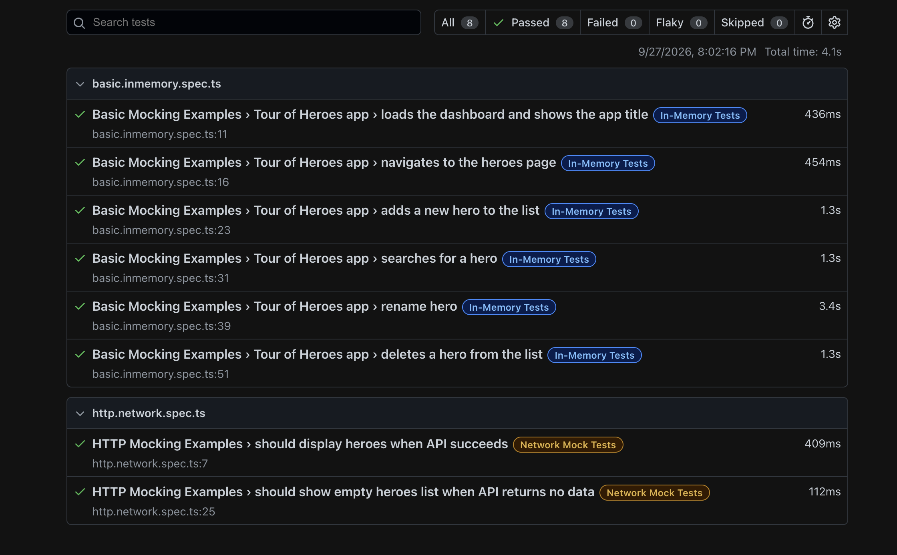
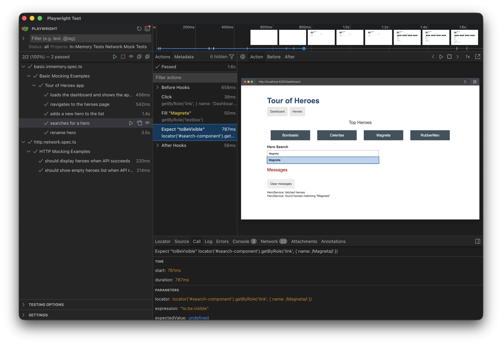
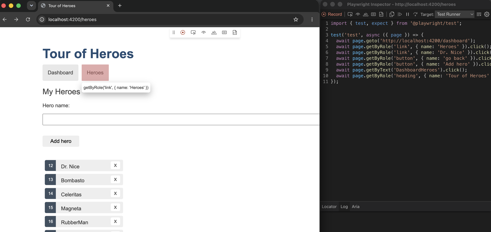
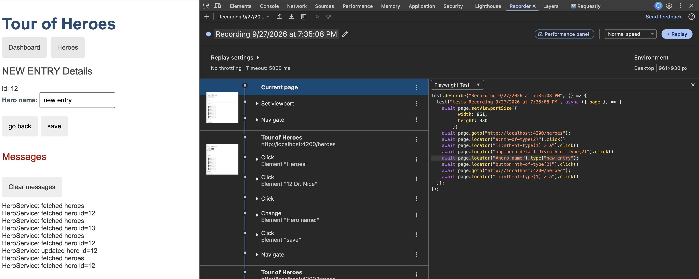

# Angular Playwright Test POC

This project is a small Angular demo app for learning Playwright testing patterns.

It includes:
- Angular Tour of Heroes app - https://v17.angular.io/guide/example-apps-list#
  - in-memory mock API support
- Playwright test suites for:
  - in-memory app flows
  - network mock scenarios

### Screenshots

**Test report:**


**Test UI:**


**Codegen:**


**Playwright Chrome Recorder extension:**

[extension link](https://chromewebstore.google.com/detail/playwright-chrome-recorde/bfnbgoehgplaehdceponclakmhlgjlpd)

### start commands:

```bash
npm start
```
```bash
npm run start:no-memory
```
 
### test commands:
```bash
npx playwright test
```

```bash
npx playwright test --ui
```
```bash
npx playwright show-report
```
```bash
npx playwright codegen http://localhost:4200
```
